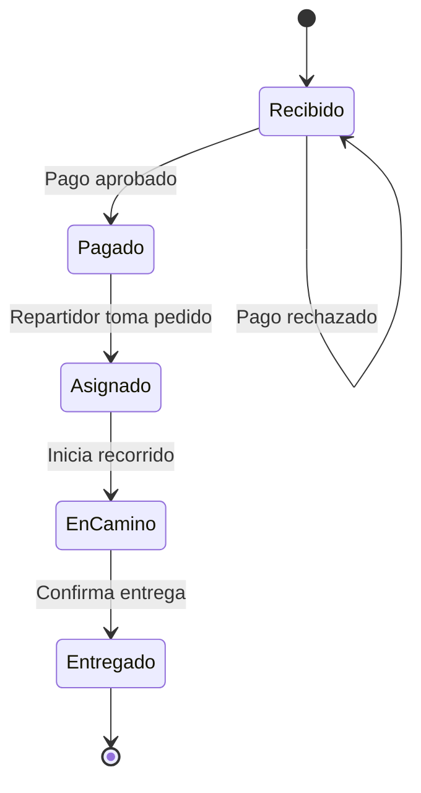

# FlashFood — POO en Python

Caso educativo para estudiantes de Analista Programador e Ingeniería Informática.
FlashFood recibe pedidos de clientes desde plataformas de comida, cobra usando distintos medios de pago y coordina su entrega con un repartidor.

## Ejecutar

Requiere Python 3.11 o superior. Desde la carpeta del repositorio:

```bash
python -m venv .venv
# Linux/macOS
source .venv/bin/activate
# Windows PowerShell: .venv\Scripts\Activate.ps1
python -m pip install -e .
flashfood
python -m unittest discover -s tests -v
```

Para la interfaz de escritorio:

```bash
python -m pip install -e ".[desktop]"
flashfood-desktop
```

Se eligió **PySide6**, el binding oficial de Qt para Python, por sus widgets, señales y herramientas de diseño. Permite enseñar eventos y separar la vista del negocio. La dependencia es opcional: el dominio, las pruebas y la consola funcionan sin Qt. Para distribuir una aplicación, revisar las condiciones de licencia de Qt/PySide6 y sus componentes.

La ventana es un laboratorio funcional con datos de ejemplo: permite crear un pedido, escoger plataforma y medio de pago, pagar, asignar, iniciar el recorrido y entregar. La edición de clientes, catálogo y persistencia quedan como ejercicios posteriores.

## Reglas del caso

1. Cada pedido tiene un cliente, una plataforma y al menos un ítem con cantidad positiva.
2. Los precios son enteros positivos en pesos chilenos (CLP), sin conversiones ni impuestos en esta versión.
3. Un pago rechazado conserva el pedido recibido y permite reintentar.
4. Un pago aprobado se realiza una sola vez y permite asignar un repartidor.
5. Un repartidor atiende un pedido activo a la vez, dentro de la instancia del servicio.
6. Se debe iniciar el recorrido antes de entregar; la entrega libera al repartidor.



## Fundamentos de POO

| Fundamento | Ejemplo concreto |
| --- | --- |
| Clases y objetos | `Pedido`, `Cliente`, `Producto` y sus instancias |
| Encapsulación | Estado de `Pedido` sin setter; operaciones que validan transiciones |
| Abstracción | Contratos `MedioPago`, `PlataformaComida`, `RepositorioPedidos` |
| Herencia | `Cliente` y `Repartidor` especializan `Persona`; pagos implementan `MedioPago` |
| Polimorfismo | `Pedido.pagar()` invoca `cobrar()` en tarjeta o billetera con el mismo contrato |
| Composición | Un pedido contiene sus `ItemPedido` |
| Asociación | Pedido referencia cliente, repartidor y productos |
| Inmutabilidad | Personas, productos, ítems y resultados son dataclasses congeladas |
| Inyección de dependencias | `ServicioPedidos` recibe su repositorio por constructor |

En Python, `_atributo` señala acceso interno por convención; no es una barrera de seguridad. Las reglas se respetan usando la API pública. La herencia de personas sirve para enseñar generalización; no se utiliza para crear jerarquías artificiales en todo el modelo.

## Estructura

- `src/flashfood/domain.py`: entidades, pagos y reglas; sin dependencia de Qt.
- `src/flashfood/application.py`: casos de uso y contratos de plataforma/repositorio.
- `src/flashfood/infrastructure.py`: repositorio en memoria.
- `src/flashfood/demo.py`: flujo completo por consola.
- `src/flashfood/desktop.py`: vista PySide6 que llama a los mismos casos de uso.
- `tests/`: pruebas de éxito, rechazo e invariantes.
- [Guía docente](docs/guia-docente.md): secuencia de clases y evaluación.

## Alcance

Los pagos y plataformas son simulados: no hay cobros reales, credenciales ni conexión con servicios comerciales. El repositorio en memoria pierde los datos al cerrar y no soporta concurrencia ni transacciones. El acceso directo a las entidades es intencional para la primera unidad. Cancelaciones, reembolsos, autenticación, notificaciones, persistencia y confirmación verificable del destinatario se incorporarán en unidades posteriores.

## Versionado

Versión inicial `0.1.0`. La integración continua ejecuta pruebas y demo en Python 3.11, 3.12 y 3.13. Cada ejercicio se recomienda implementar en una rama y revisar mediante pull request.
