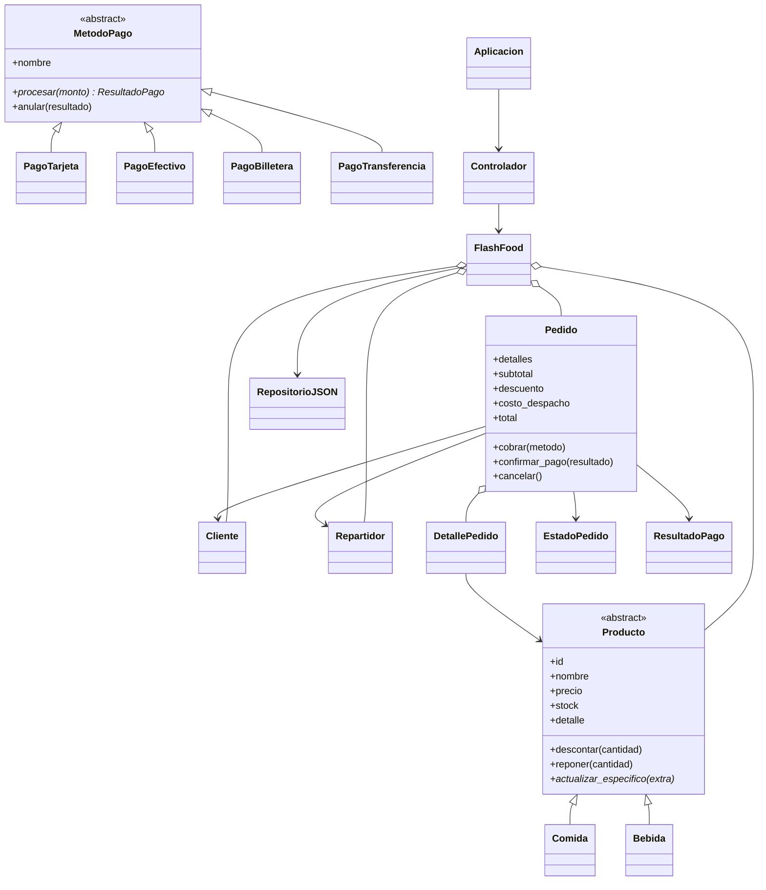

# Diagrama de clases

```mermaid
classDiagram
    class Producto {
        <<abstract>>
        +id
        +nombre
        +precio
        +stock
        +detalle
        +descontar(cantidad)
        +reponer(cantidad)
        +actualizar_especifico(extra)*
    }
    class Comida
    class Bebida
    Producto <|-- Comida
    Producto <|-- Bebida

    class MetodoPago {
        <<abstract>>
        +nombre
        +procesar(monto) ResultadoPago*
        +anular(resultado)
    }
    class PagoTarjeta
    class PagoEfectivo
    class PagoBilletera
    class PagoTransferencia
    MetodoPago <|-- PagoTarjeta
    MetodoPago <|-- PagoEfectivo
    MetodoPago <|-- PagoBilletera
    MetodoPago <|-- PagoTransferencia

    class Cliente
    class Repartidor
    class DetallePedido
    class Pedido {
        +detalles
        +subtotal
        +descuento
        +costo_despacho
        +total
        +cobrar(metodo)
        +confirmar_pago(resultado)
        +cancelar()
    }
    class EstadoPedido
    Pedido o-- DetallePedido
    Pedido --> Cliente
    Pedido --> Repartidor
    Pedido --> EstadoPedido
    Pedido --> ResultadoPago
    DetallePedido --> Producto

    class FlashFood
    class RepositorioJSON
    class Controlador
    class Aplicacion
    FlashFood o-- Producto
    FlashFood o-- Cliente
    FlashFood o-- Pedido
    FlashFood o-- Repartidor
    FlashFood --> RepositorioJSON
    Controlador --> FlashFood
    Aplicacion --> Controlador
```

`PagoTransferencia` entra por el mismo contrato `MetodoPago`. `FlashFood.pagar` no tiene una rama por cada medio: recibe el objeto y el pedido llama a `procesar`.
